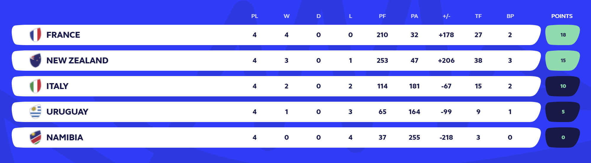

# Partial 1 - Rugby World Cup 2023

## Introduction

Welcome to the Rugby World Cup Stats Wrapper API! This API is designed to provide 
developers with easy access to a comprehensive collection of statistical data from 
the Rugby World Cup. Whether you're building a sports analysis tool, a fan website, 
or any other application that requires Rugby World Cup statistics, this API will 
serve as your go-to resource.

### What is the Rugby World Cup?

The Rugby World Cup is one of the most prestigious and widely followed international 
rugby tournaments. Held every four years, it brings together the best national rugby 
teams from around the world to compete for the title of World Champion. The 
tournament features thrilling matches, iconic moments, and a rich history dating 
back to its inception in 1987.

## API Features

### Pool Standings API

Building a Pool Standings API based on match results involves collecting 
and processing match data to determine the rankings of teams within a pool. 

Here's a step-by-step guide on how to create such an API, including how to 
calculate the standings based on match results:

#### 1 - Define Your API Endpoints:

Start by defining the endpoints for your Pool Standings API. You might have endpoints like:

```http
/rwc/2023/pools: To list all available pools with standings.
/rwc/2023/pools/{pool_id}: To retrieve standings for a specific pool.
```

#### 2 - Collect Match Data:

You'll need to collect data on the matches within each pool. This data should 
include details such as the teams playing, the scores, and any other relevant 
match information. You can gather it from a reliable data source, such as an 
external API.

#### 3 - Calculate Team Standings:

To calculate the standings of teams within a pool, you can use the following 
approach:

Iterate through the match data for each pool.

For each match, update the standings table accordingly:

1. If a team wins, increment their Wins count, add the match's Points For 
to their Points For count, and add the match's Points Against to their Points 
Against count.
2. If a match ends in a draw, increment both teams' Draws count and update 
their Points For and Points Against.
3. If a team loses, increment their Losses count, add the match's Points For 
to their Points Against count, and add the match's Points Against to their 
Points For count.
4. After processing all the matches, calculate the Points Differential 
(Points For minus Points Against) for each team.
5. Calculate the pool points for each team based on the following criteria:
   * 4 points for a win
   * 2 points for a draw
   * 0 points for a loss
   * 1 bonus point for scoring 4 or more tries in a match
   * 1 bonus point for losing by 7 or fewer points in a match

Example of response in a front end


#### 4- API Endpoints Implementation:

Implement the API endpoints to retrieve pool standings. When a user requests 
standings for a specific pool, fetch the data from the corresponding standings 
and return it in a JSON format.

##### Sample JSON Response

```json
{
  "pool_id": "A",
  "teams": [
    {
      "team_id": 1,
      "team_name": "Team A",
      "country": "Country A",
      "matches_played": 4,
      "wins": 2,
      "draws": 1,
      "losses": 0,
      "points_for": 80,
      "points_against": 50,
      "points_differential": 30,
      "tries_made": 10,
      "bonus points": 2,
      "points": 7,
      "total_yellow_cards": 2,
      "total_red_cards": 0
    },
    {
      "team_id": 2,
      "team_name": "Team B",
      "country": "Country B",
      "matches_played": 4,
      "wins": 2,
      "draws": 1,
      "losses": 0,
      "points_for": 80,
      "points_against": 50,
      "points_differential": 30,
      "tries_made": 10,
      "bonus points": 2,
      "points": 7,
      "total_yellow_cards": 2,
      "total_red_cards": 0
    },
    {
      "team_id": 3,
      "team_name": "Team C",
      "country": "Country C",
      "matches_played": 4,
      "wins": 2,
      "draws": 1,
      "losses": 0,
      "points_for": 80,
      "points_against": 50,
      "points_differential": 30,
      "tries_made": 10,
      "bonus points": 2,
      "points": 7,
      "total_yellow_cards": 2,
      "total_red_cards": 0
    },
    {
      "team_id": 4,
      "team_name": "Team D",
      "country": "Country D",
      "matches_played": 4,
      "wins": 2,
      "draws": 1,
      "losses": 0,
      "points_for": 80,
      "points_against": 50,
      "points_differential": 30,
      "tries_made": 10,
      "bonus points": 2,
      "points": 7,
      "total_yellow_cards": 2,
      "total_red_cards": 0
    }
  ]
}

```

## Requirements

1. The application must be implemented as a microservice using SpringBoot Framework.
2. The application must be implemented using Java 17.
3. The application must be implemented using Maven.
4. The rest clients must be implemented using Rest Template.
5. The Rest clients must implement the circuit breaker pattern using Resilience4j.
6. The application must be tested using JUnit 5 and Mockito.
7. The application must have 60% code coverage.
8. The application must be deployed using Docker.

## Source of data

```http
https://my-json-server.typicode.com/LCIV-2023/fake-api-rwc2023
```
